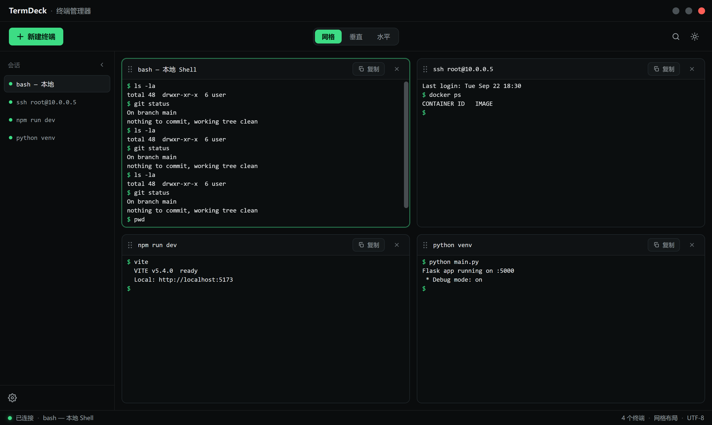
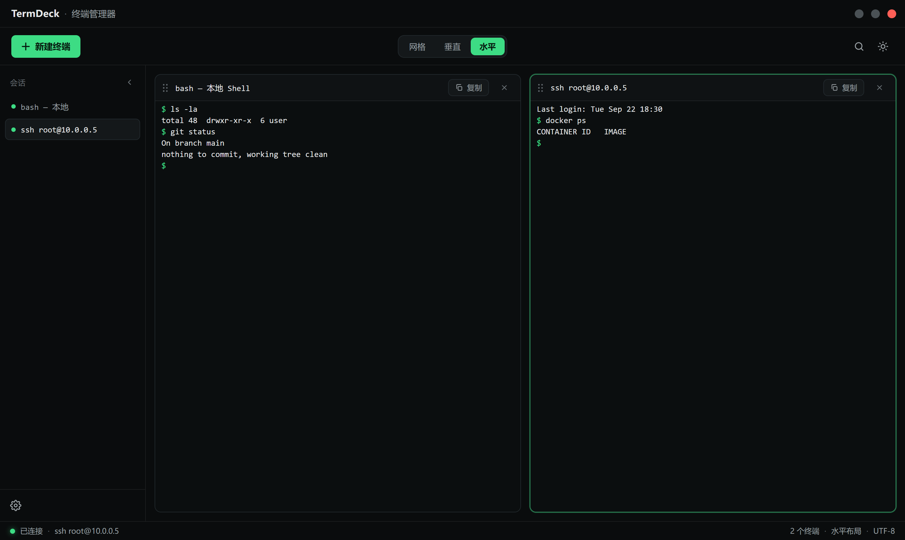
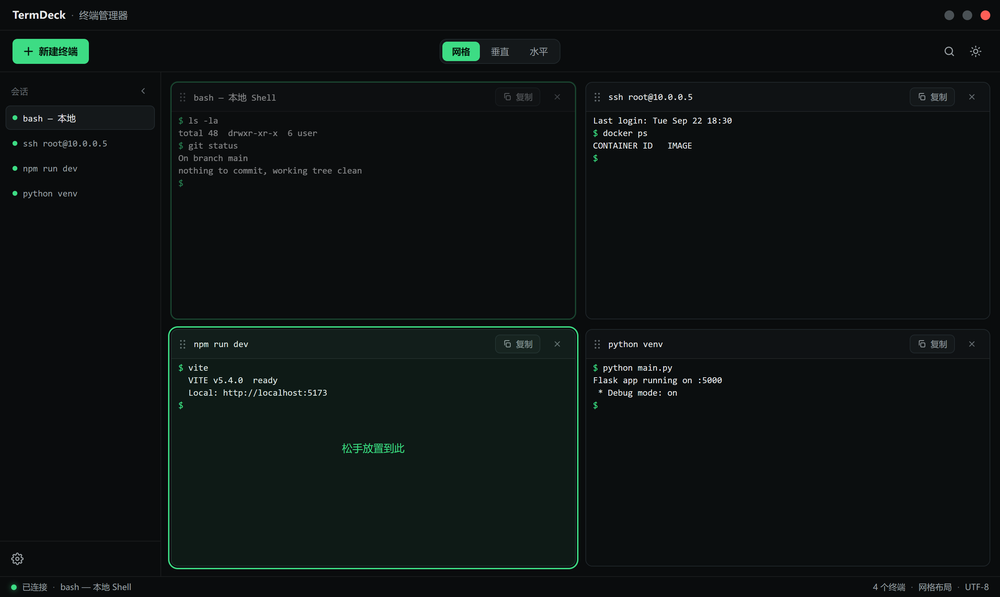
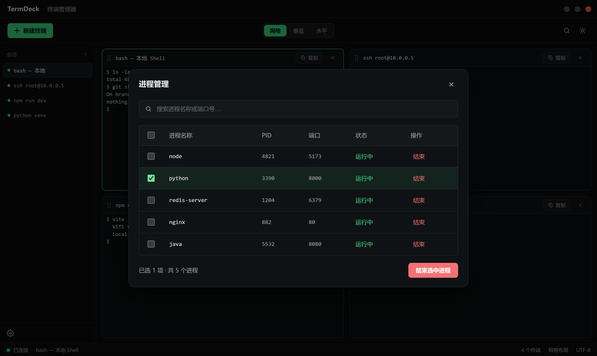
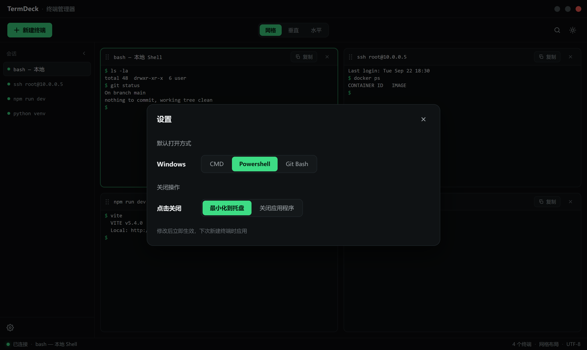
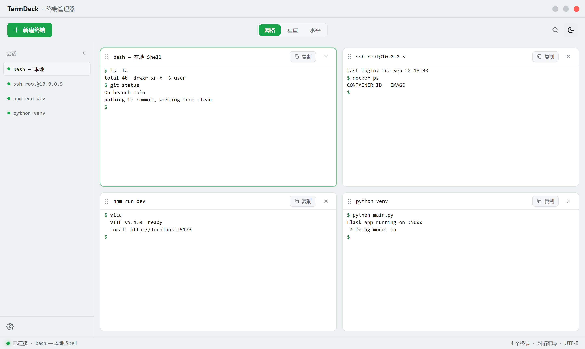

# TermDeck · 终端管理器

一款基于 **Tauri v2 + Vue 3 + TypeScript** 的多终端管理桌面应用。

## 功能特性

- **真实终端** — 每个面板都由活跃的 PTY(`portable-pty`)驱动,并使用
  `xterm.js` 渲染。Shell 根据"默认 Shell"设置启动。
- **布局模式** — 网格 (grid) / 垂直 (vertical) / 水平 (horizontal),
  仅有一个终端时自动切换为单面板视图。
- **会话侧边栏** — 创建、选择和关闭终端;双击名称可重命名(面板标题
  同步更新);带实时状态指示点。
- **拖拽重排** — 抓住面板标题栏拖到另一个槽位(绿色"松手放置到此"
  为放置目标)。
- **设置** — 为**当前平台**选择默认 Shell(Windows:
  CMD / PowerShell / Git Bash;macOS: Bash / zsh / iTerm),仅列出
  本机实际已安装的 Shell。可配置关闭按钮行为:**最小化到托盘**
  (默认)或**退出应用**。
- **进程管理器** — 实时进程表格,包含名称 / PID / 监听端口 / 状态,
  支持搜索、多选和结束进程。
- **主题** — 深色(默认)和浅色,终端配色跟随主题切换。
- **复制终端** — 面板的"复制"按钮会在同一工作目录下新开一个终端。
- **便携配置** — 设置和主题保存到可执行文件旁的 `termdeck.json`
  (若安装目录只读,则回退到应用数据目录)。

## 界面预览

以下截图取自浏览器预览模式(`pnpm dev`),终端内容由内置回声 Shell 生成。

### 网格布局 · 深色主题(默认)

四个终端面板平铺,左侧会话列表带实时状态点,底部状态栏显示终端数量与布局。



### 水平分栏



### 拖拽重排

抓住面板标题栏左侧的握把拖到另一个槽位,绿色"松手放置到此"即放置目标。



### 进程管理器

名称 / PID / 监听端口 / 状态,支持搜索、多选与结束进程。



### 设置

为当前平台选择默认 Shell,并配置关闭按钮的行为。



### 浅色主题

终端配色随主题一起切换。



## 架构

```
src/                     Vue 3 + TS 前端
  services/              运行时选择的 backend(Tauri IPC 或浏览器预览)
    backend.ts           接口定义 + 平台检测
    tauriBackend.ts      通过 invoke + Channel 调用 Rust PTY/进程命令
    previewBackend.ts    浏览器内置回声 Shell + 示例进程数据(开发预览)
  stores/termdeck.ts     响应式应用状态(会话、布局、主题、设置)
  components/            TitleBar、Toolbar、SessionList、TerminalWorkspace、
                         TerminalPane(xterm)、StatusBar、SettingsModal、ProcessModal
src-tauri/               Rust 后端(Tauri v2)
  src/terminal.rs        portable-pty 管理器(创建/接入/写入/调整大小/关闭)+ Shell 检测
  src/process.rs         sysinfo 进程表 + netstat/lsof 端口归属
  src/config.rs          安装目录配置持久化 + 关闭到托盘行为(系统托盘)
```

前端在 Tauri 环境和纯浏览器中完全一致,仅在 IPC 边界处切换服务层。
运行 `pnpm dev` 时会基于预览后端打开应用,无需原生 Shell 即可
完整交互。

## 开发

```bash
pnpm install
pnpm dev          # 浏览器预览(回声 Shell + 示例进程数据)
pnpm tauri:dev    # 原生应用,真实 PTY 和实时进程表
pnpm build        # 类型检查(vue-tsc)+ 生产构建
pnpm tauri:build  # 打包桌面应用
```

## 说明

- Windows 通过 `portable-pty` 使用 ConPTY;macOS/Linux 使用标准 PTY。
- 进程端口通过 `netstat -ano`(Windows)或 `lsof -i -P -n`
  (macOS/Linux)归属;当不可用时,表格回退为显示完整进程列表。
